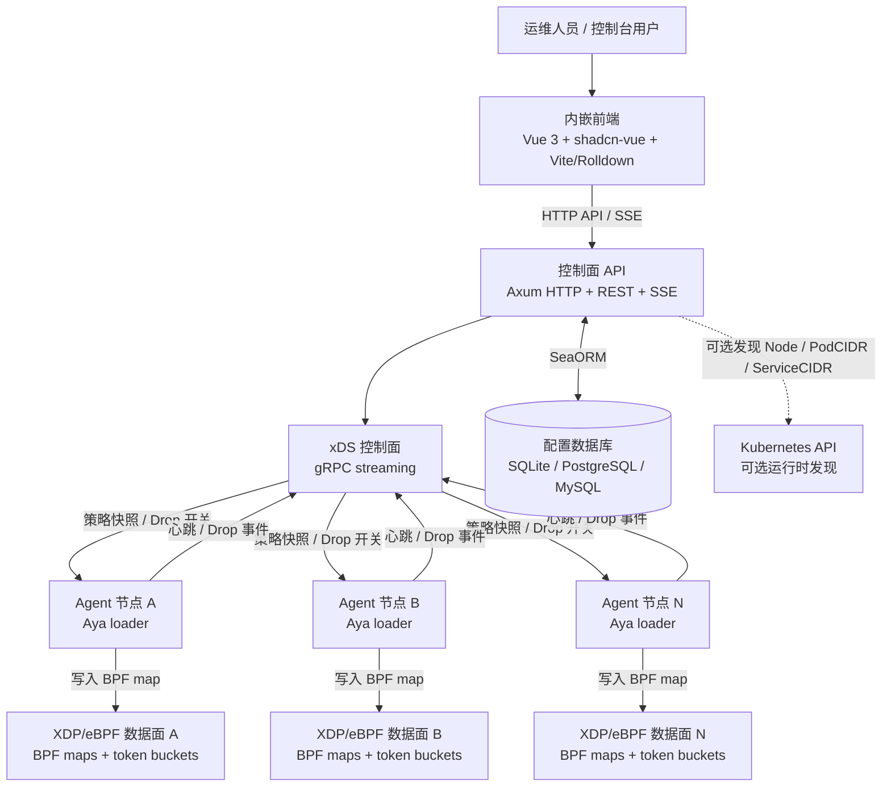
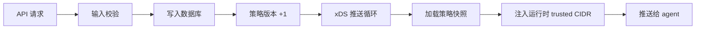
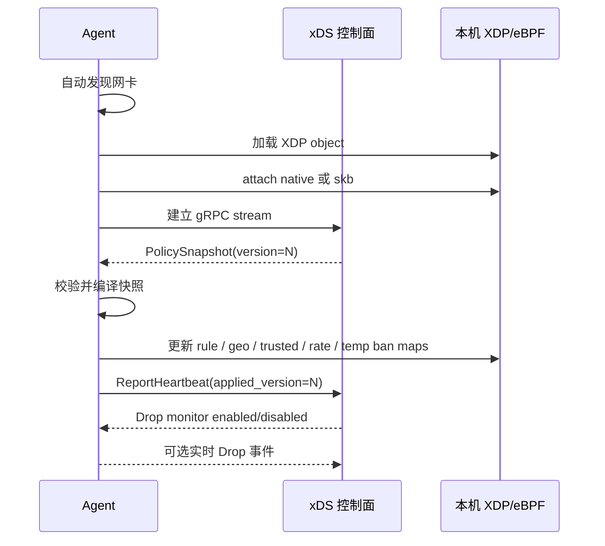
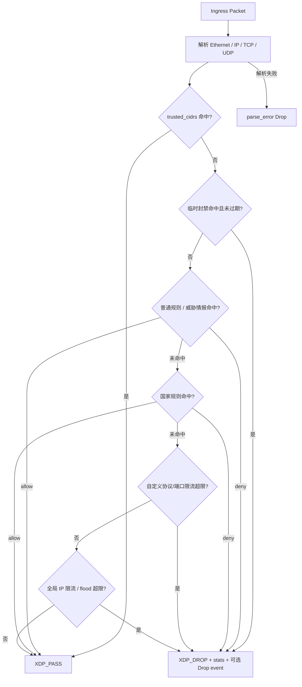
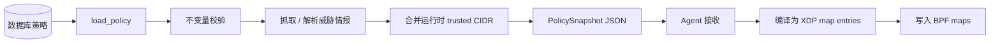
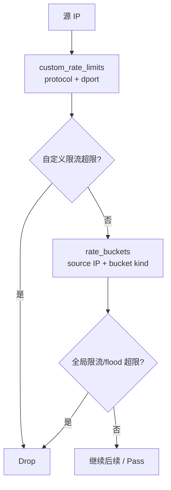
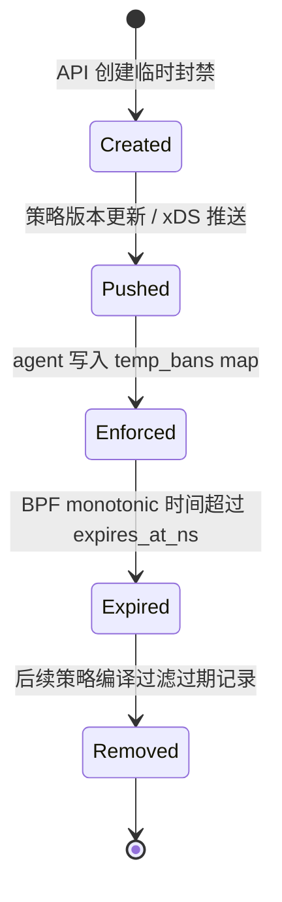
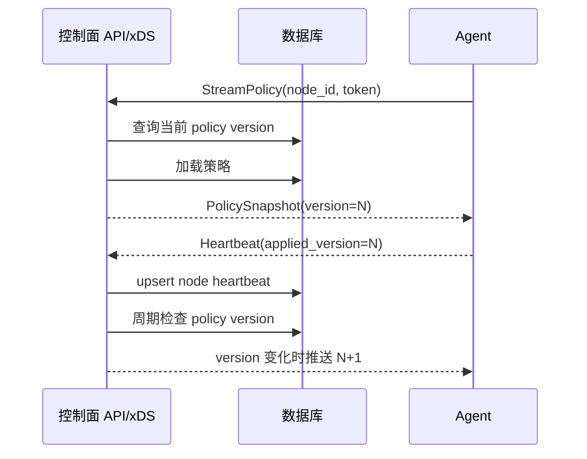
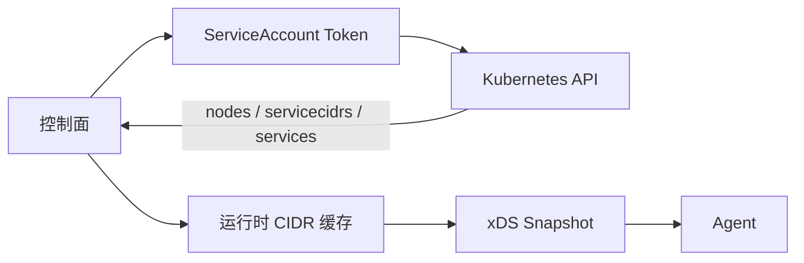

# XDP Firewall 整体设计方案

## 方案概述

XDP Firewall 是一个基于 Linux XDP/eBPF 的分布式 L3/L4 防火墙与动态防御系统。系统将“配置管理”和“数据面执行”拆开：

- 控制面负责 Axum HTTP API、内嵌 Vue 控制台、数据库持久化、策略编译和 gRPC xDS 推送。
- 每台服务器运行一个 agent，通过 xDS 订阅策略，使用 Aya 加载 XDP 程序，并把策略快照写入本机 BPF map。
- 单机场景支持 SQLite；多机场景使用 PostgreSQL 或 MySQL 作为共享配置源。
- `trusted_cidrs`、Kubernetes 网络发现、实时 Drop 观测等运行时能力通过 xDS 下发，不要求 agent 直接连接数据库。

设计目标是把防护动作尽可能前移到内核网络入口，在进入 Linux 协议栈前完成放行、拒绝、国家规则、威胁情报、限流和临时封禁判断，同时保留集中化配置、分布式下发和可观测性。

## 设计目标

1. 在 XDP 层完成主要包处理，降低进入协议栈后的 CPU 成本。
2. agent 不连接配置数据库，避免把数据库凭据分发到所有服务器。
3. 对用户暴露单一全局策略，减少多策略选择带来的运维歧义。
4. 配置持久化支持 SQLite、PostgreSQL、MySQL。
5. 控制面通过 xDS 主动向 agent 推送策略，推送频率由控制面统一控制。
6. Kubernetes Pod CIDR、Service CIDR、Node IP 等运行时地址不写入数据库，只在下发快照时注入。
7. 提供规则级、分类级、节点级、源 IP、协议、端口维度的 Drop 可观测性。
8. 一个 Rust 二进制内嵌前端资源，Docker 镜像包含 API、xDS、agent、eBPF object 和 UI。

## 总体架构

控制面是唯一持久化配置写入方。agent 只接收策略快照、应用本机 BPF map、上报心跳和观测数据。这种拆分使数据库凭据、策略版本、运行时注入和节点状态边界更清晰。

## 控制面设计

默认 `api` 命令同时启动 HTTP API 和 gRPC xDS 服务。

控制面职责：

- 启动时自动执行数据库迁移。
- 提供 REST API 和内嵌前端控制台。
- 校验 API 输入并写入用户管理的配置。
- 维护单一策略版本号。
- 从数据库加载策略并编译成 xDS 快照。
- 在快照发送前注入运行时 trusted CIDR。
- 可选读取 Kubernetes API，发现 Node IP、Pod CIDR 和 Service CIDR。
- 接收 agent 心跳和实时 Drop 事件。
- 将实时 Drop 事件通过 SSE 广播给前端订阅者。

API 和 xDS 合并为一个默认控制面服务，是为了降低部署复杂度。独立 `xds` 命令仍保留，便于调试或特殊拆分部署。

## Agent 设计

agent 是每台服务器上的执行进程。

agent 职责：

- 未指定 `--interface` 时自动从默认路由发现网卡。
- 从默认路径或自定义路径加载 XDP object。
- `auto` 模式下优先 native driver XDP，失败后回退到 skb XDP。
- 通过 xDS 长连接订阅策略。
- 校验 agent token。
- 把每次新策略写入本机 BPF map。
- 上报节点心跳、应用版本、统计计数和可选 Drop 事件。
- 不连接数据库、不修改策略表。

## XDP/eBPF 数据面设计

XDP 程序在入口包进入 Linux 协议栈前执行，主要逻辑在 BPF map 中完成查找，不依赖每包 userspace 调用。

核心 BPF map：

- `rule_cidrs`：普通规则和威胁情报前缀，LPM trie。
- `geo_cidrs`：IP 到国家代码的前缀映射，LPM trie。
- `trusted_cidrs`：最高优先级白名单，LPM trie。
- `country_rules`：国家 allow/deny 配置，hash map。
- `defense_policy`：全局动态防御配置，array map。
- `custom_rate_limits`：协议/目的端口自定义限流配置，hash map。
- `rate_buckets`：每源 IP token bucket 状态，LRU hash map。
- `temp_bans`：临时封禁源 CIDR，LPM trie。
- `stats`：分类计数器，array map。
- `drop_events`：实时 Drop perf event。
- `drop_config`：实时 Drop 开关。

## 策略模型

系统对用户只暴露一个全局策略。数据库内部仍保留 `edge` 作为兼容 key，但 UI 和 API 不提供多策略创建、选择或切换。

持久化表：

- `firewall_policy_versions`：策略版本。
- `firewall_rules`：普通 CIDR allow/deny 规则，`rule_key` 为必填唯一管理键；创建请求未提供时按 priority、action、CIDR、protocol、port 生成 UUID-like hash。
- `firewall_geo_country_policies`：国家 allow/deny 规则。
- `firewall_geo_country_catalog`：从 IPdeny `/ipblocks/` 页面发现并持久化的国家列表，包含国家短码、完整名称、下载 URL 和上游更新时间。
- `firewall_geo_ip_list_states`：每个国家 IP 列表的远端更新时间、检查时间和前缀数量。
- `firewall_geo_ip_prefixes`：已下载并持久化的国家 CIDR 列表，每个国家一行，CIDR 以 JSON 数组保存，agent 不直接访问 IPdeny。
- `firewall_dynamic_defense`：全局 IP 限流和 flood 配置。
- `firewall_dynamic_rate_limits`：按协议和目的端口配置的自定义限流。
- `firewall_temp_bans`：临时源 CIDR 封禁。
- `firewall_trusted_cidrs`：数据库管理的白名单。
- `firewall_threat_sources`：威胁情报源配置。
- `firewall_threat_source_states`：威胁情报源的最近指纹、检查时间和前缀数量。
- `firewall_threat_prefixes`：已下载并持久化的威胁 CIDR 列表，每个威胁源一行，CIDR 以 JSON 数组保存，agent 不直接访问威胁情报源。
- `firewall_nodes`：节点心跳和已应用版本。

运行时注入项：

- `api/xds --trusted-cidr`。
- `XDP_FIREWALL_TRUSTED_CIDRS`。
- Kubernetes 发现到的 Node IP、Pod CIDR、Service CIDR、Service ClusterIP。
- agent 本地识别到的控制面 IP 字面量。

运行时注入项只进入 xDS 下发快照，不写入数据库，也不显示为用户管理的白名单行。

控制面启动时会从 `firewall_geo_ip_prefixes.cidrs_json` 生成内存 MMDB；国家 IP 列表有变更并写入数据库后，也会重新生成 MMDB。MMDB 记录包含 `country.iso_code` 和 `country.names.en`，用于控制台 IP 归属查询和实时 Drop 事件国家短码补全，不替代下发给 eBPF 的 `geo_cidrs` LPM trie。

## 规则优先级

数据面执行顺序：

1. 白名单：命中 `trusted_cidrs` 后立即放行。
2. 临时封禁：命中源 CIDR、可选协议、可选目的端口后，在过期前拒绝。
3. 普通防火墙规则和威胁情报 deny 前缀。
4. 国家 allow/deny 规则。
5. 自定义动态防御限流：按协议和目的端口匹配。
6. 全局动态防御：每源 IP `ip_rate_limit` 和 `flood`。
7. 默认放行。

白名单优先级最高是一个明确设计选择。它用于保护控制面、Kubernetes 内部地址和运维地址不被宽泛 deny 或动态防御误伤。相应代价是：错误配置的白名单会绕过所有拒绝和限流逻辑，因此白名单应按基础设施 allow list 的标准管理。

## 策略编译与下发

策略从数据库到 BPF map 的链路如下：

编译阶段做的关键处理：

- 动态防御启用时，PPS、burst、block seconds 等字段必须有效，避免零值 fail-open。
- 威胁情报只允许内置或显式允许的 host。
- CIDR、协议、端口统一规范化。
- 过期临时封禁不进入下发快照。
- 普通规则按有效 key 去重，低数字 priority 优先。
- 威胁情报 deny 前缀优先于重复 key 的用户 allow。
- 下发前检查 BPF map 容量，避免部分写入后才失败。

## 动态防御设计

动态防御分为两层。

全局动态防御：

- `ip_rate_limit`：每源 IP token bucket。
- `flood`：每源 IP token bucket，超限后进入临时 block window。

自定义动态限流：

- 可按协议匹配，例如全部 TCP。
- 可按目的端口匹配，例如 22、80、443。
- 可组合协议和目的端口，例如 TCP/22。
- 执行优先级高于全局 `ip_rate_limit` 和 `flood`。

`rate_buckets` 使用 LRU hash map，避免扫描流量制造无限状态。容量达到上限时，旧的 bucket 会被淘汰，保护内存边界。

## 临时封禁设计

临时封禁用于人工处置或后续自动化联动。它面向“某个源 CIDR 临时禁止访问”，可用 /32 或 /128 表示单个源 IP，可选限制到协议和目的端口，默认时长 5 分钟。

实现方式：

- 控制面保存 wall-clock 过期时间。
- agent 应用策略时转换成 BPF 可直接比较的 monotonic ns。
- BPF 每包判断时只比较当前 monotonic 时间，不需要 userspace 定时清理才能停止封禁。
- Drop 原因标记为 `temporary_ban`。

## 威胁情报设计

系统内置威胁情报源：

- `ipsum`
- `spamhaus-drop`
- `voipbl`: `https://voipbl.org/update/`，按一行一个 IP/CIDR 解析，忽略注释行。

安全约束：

- 拒绝带 URL credentials 的源。
- 最多跟随 3 次重定向，且重定向目标仍必须是允许的 host。
- 设置请求超时。
- 设置响应大小上限。
- 默认只允许内置 host，额外 host 必须显式配置。

威胁情报最终会编译成 deny 前缀规则，和普通规则一起进入 XDP LPM trie，但在重复 key 场景下威胁情报 deny 优先。

agent 默认开启 `XDP_FIREWALL_AUTO_RESIZE_MAPS`。当策略需要的规则、地理、可信前缀、国家规则、自定义限速或临时封禁条目数超过当前 pinned map 容量时，agent 会卸载 XDP、删除 pinned maps、按 `max(required, current * 2)` 向上取整重建 map，并重新应用同一策略；容量足够时先写入新 key/value，再清理不属于新策略的旧 key。

## xDS 控制面

agent 通过 gRPC streaming 连接 xDS。控制面按配置的 push interval 检查策略版本，并在版本变化或 Drop 监控开关变化时推送更新。

xDS 特性：

- agent 不轮询数据库。
- 控制面统一控制推送频率。
- 心跳通过 xDS 上报，并以 upsert 写入数据库。
- 非 loopback 绑定必须配置 agent token。
- 支持 `Authorization: Bearer <token>` 和 `x-agent-token`。
- 慢客户端或断开的 stream 会被关闭，避免后台任务泄漏。

## Kubernetes 运行时发现

启用后，控制面通过 Kubernetes API 发现集群网络地址，并作为运行时 trusted CIDR 注入 xDS 快照。

发现内容：

- Node `InternalIP` / `ExternalIP`。
- Node `spec.podCIDR` / `spec.podCIDRs`。
- `networking.k8s.io/v1 ServiceCIDR`。
- 当 ServiceCIDR 不可用或无权限时，回退采集已有 Service `clusterIP` / `clusterIPs`。

该能力只在控制面开启，agent 不访问 Kubernetes API。发现失败时复用上一次成功缓存和静态运行时 CIDR，避免因为 Kubernetes API 短暂异常中断策略下发。

## 可观测性设计

系统提供三层可观测能力。

### Agent 日志

agent 打印：

- 选中的 interface。
- XDP attach 模式。
- 应用的 policy version。
- 规则数量、国家规则数量、白名单数量、威胁源数量。
- 动态防御开关和参数。
- 每次心跳的 XDP counters。
- 实时 Drop 事件会经 xDS 上报到控制面；如果事件本身没有国家短码，控制面用内存 MMDB 按源 IP 补全。

counter 分类：

- `pass`
- `rule_drop`
- `geo_drop`
- `temp_ban_drop`
- `custom_rate_drop`
- `rate_drop`
- `flood_drop`
- `parse_drop`
- `drop_total`

### Monitor CLI

`xdp-firewall monitor` 用于本地排障，类似轻量级 agent diagnostics：

- 网卡状态。
- MTU、carrier。
- bpffs mount。
- agent-only 状态。
- xDS 连通性。
- 当前 xDS policy 摘要。
- JSON line 输出。

`xdp-firewall monitor --drop` 读取 pinned perf event map，实时打印被 drop 的包。

### 前端实时 Drop

前端实时 Drop 页面支持：

- 订阅全部节点。
- 订阅指定节点。
- 按源 IP、协议、目的端口做前端过滤。
- 显示 node_id、src_ip、family、proto、dport、country、reason、action。

实时 Drop 是按需开启的。API 维护 SSE 订阅数，并通过 xDS 告诉匹配 agent 是否启用 Drop 上报。没有订阅者时，agent 不应该启动 perf reader，也不应该持续输出 Drop event。

## API 与前端

Axum API 提供：

- 策略读取和版本管理。
- 普通规则 CRUD。
- 国家规则 CRUD。
- 国家列表刷新和 IP 归属查询。
- 手动国家列表刷新会异步覆盖所有国家；控制面进程内按 5 分钟窗口限制启动频率，窗口内重复请求直接返回上一次刷新结果。
- 白名单 CRUD。
- 威胁源 CRUD。
- 动态防御配置。
- 自定义动态限流 CRUD。
- 临时封禁 CRUD。
- 节点状态分页查询。
- 实时 Drop SSE。
- 内嵌前端静态资源。

前端特性：

- Vue 3。
- shadcn-vue 风格组件。
- Vite/Rolldown 构建。
- hash 路由，适配 Rancher 和反向代理路径。
- 相对 API URL。
- 默认中文，支持中英文切换。
- API token 只保存在内存中，离开页面清空。
- 页面内提供 API 使用文档和 curl 示例。

前端资源会在 Docker build 时先构建，再嵌入 Rust 二进制。最终镜像启动后不依赖外部静态文件服务器。

## 部署模型

### 单机部署

使用 SQLite。API/control-plane 和 agent 可以在同一台服务器运行，agent 连接本机 xDS。

### 多机部署

使用 PostgreSQL 或 MySQL。控制面连接数据库，所有 agent 只连接 xDS，不连接数据库。

### Kubernetes 部署

参考部署包含：

- API Deployment。
- Agent DaemonSet。
- Secret 保存 database URL、API token、agent token。
- RBAC 支持 Kubernetes runtime discovery。
- agent 使用 hostNetwork、privileged 和 `/sys/fs/bpf` 挂载。

默认控制面单副本运行，因为实时 Drop 订阅状态目前在进程内存中。若要多副本，需要 sticky routing 或共享 pub/sub 后端承载 Drop event 和订阅状态。

## 安全模型

认证：

- HTTP API 使用 API token 保护配置接口。
- xDS 使用 agent token 保护策略下发和心跳上报。
- 非 loopback bind 如果未配置 token，默认拒绝启动，除非显式启用不安全开关。

隔离：

- agent 不持有数据库凭据。
- 运行时 trusted CIDR 与数据库白名单分离。
- Kubernetes discovery 只在控制面执行。

数据面安全：

- 包解析必须做边界检查。
- 畸形 TCP/UDP 解析路径按 `parse_error` drop。
- 威胁情报抓取限制 host、超时、重定向和响应大小。

运维注意：

- 白名单是最高优先级，配置错误会绕过普通防火墙、威胁情报、国家规则和动态防御。因此白名单应视为高权限配置。

## 性能设计

性能关键点：

- 每包决策在 XDP/eBPF 内完成，不进入 userspace。
- CIDR 匹配使用 LPM trie。
- 动态防御状态使用 LRU hash map，限制内存增长。
- Drop telemetry 默认关闭，只有存在订阅时才启用。
- 威胁情报抓取和策略编译集中在控制面，避免每个 agent 重复抓取。
- xDS push interval 控制全局策略推送频率，避免变更风暴。

默认 BPF map 容量：

| Map | 默认容量 | 作用 |
| --- | ---: | --- |
| `rule_cidrs` | 262144 | 普通规则和威胁情报 CIDR |
| `geo_cidrs` | 262144 | IP 到国家代码映射 |
| `trusted_cidrs` | 4096 | 最高优先级白名单 |
| `country_rules` | 676 | 国家 allow/deny |
| `rate_buckets` | 1048576 | 动态防御每源 IP token bucket |
| `custom_rate_limits` | 4096 | 自定义协议/端口限流 |
| `temp_bans` | 4096 | 临时封禁 |

其中 `rate_buckets` 是主要内存消耗来源。map 容量在 agent 加载 XDP object 时确定，修改容量需要重启 agent 重新创建 BPF map。

## 技术深度与难点

这个系统的难点不只是“写一个防火墙规则表”，而是把数据库配置、分布式控制面、内核数据面和运维观测连成一个一致的系统。

核心难点：

1. XDP/eBPF 数据面开发：程序必须满足 verifier 约束，所有包头访问都要严格 bounds check，不能使用不受限循环，每包指令数和 map 查找次数都要可控。
2. Rust 与 BPF ABI 对齐：Rust userspace 结构体和 C BPF 结构体必须保持字段顺序、大小、对齐一致，否则 map key/value 会静默错位。
3. 分布式策略一致性：数据库版本、xDS 快照、agent applied_version、心跳状态要在失败、重启、网络抖动时仍能解释清楚。
4. 运行时策略注入：Kubernetes discovery、CLI/env trusted CIDR、agent 本地控制面 IP 需要影响下发结果，但不能污染用户持久化配置。
5. 动态防御状态管理：限流需要在内核态维护 per-source 状态，同时控制内存上限和高并发下的性能。
6. 按需实时观测：Drop event 必须能定位源 IP、协议、端口和原因，但不能默认对每个被 drop 的包都产生额外 perf event 成本。
7. 多数据库兼容：SeaORM migration 和 query 要同时适配 SQLite、PostgreSQL、MySQL。
8. 打包复杂度：一个镜像需要包含 Rust 控制面、agent、Aya loader、eBPF object 和内嵌前端 hash assets。
9. 失败模式设计：观测失败不能拖垮执行面；Kubernetes discovery 失败不能阻断策略下发；xDS 慢客户端不能泄漏后台任务。

真正的工程挑战在于：既要保持内核数据面足够快，又要让控制面、策略模型、运行时注入、实时观测和部署运维保持可解释、可恢复、可扩展。

## 已知限制与演进方向

当前限制：

- 实时 Drop 广播状态保存在控制面进程内存中。
- XDP 程序目前只处理 ingress。
- SQLite 只适合单机部署。
- Kubernetes Service CIDR 发现依赖集群 API 支持，不支持时只能使用已有 Service ClusterIP 作为部分 fallback。

后续计划：

- 保持临时封禁 CIDR fallback 查找的覆盖关系和过期处理测试。
- 让前端 API 文档页在未输入 token 时也能阅读。
- 保持 README 的 BPF stats 文档与实际 counter 数量一致。
- 增加临时封禁、自定义动态防御、xDS Drop 订阅生命周期的集成测试。
- 如需控制面多副本，增加共享 pub/sub 后端承载实时 Drop 事件和订阅状态。
