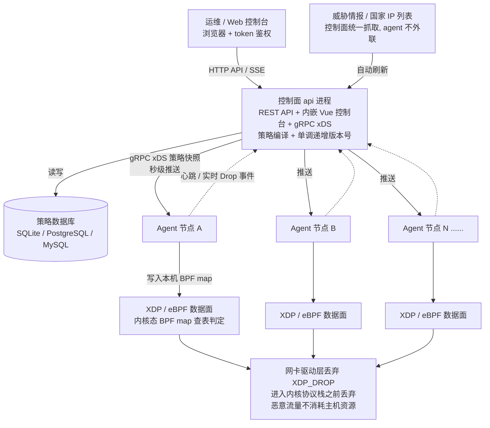
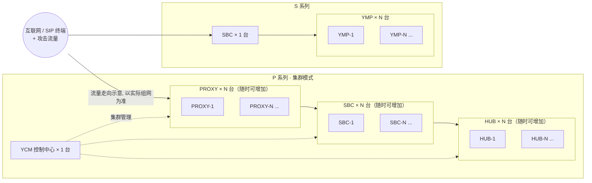
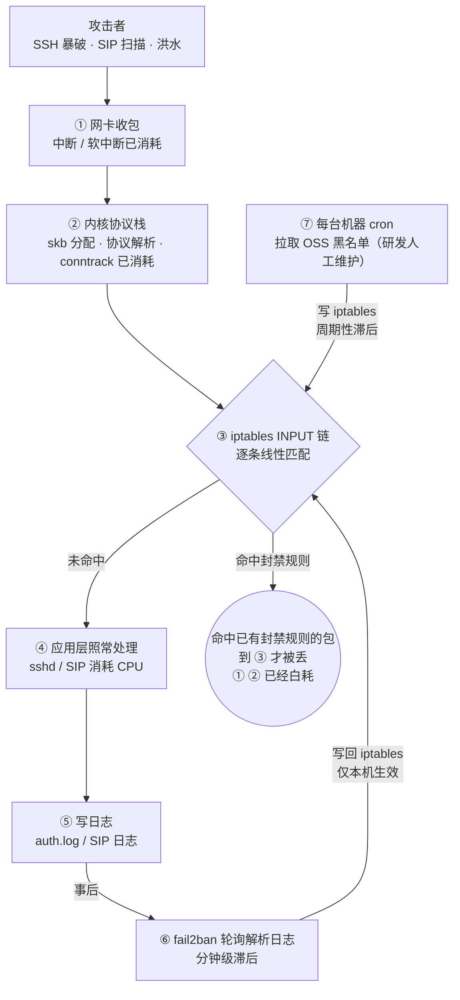
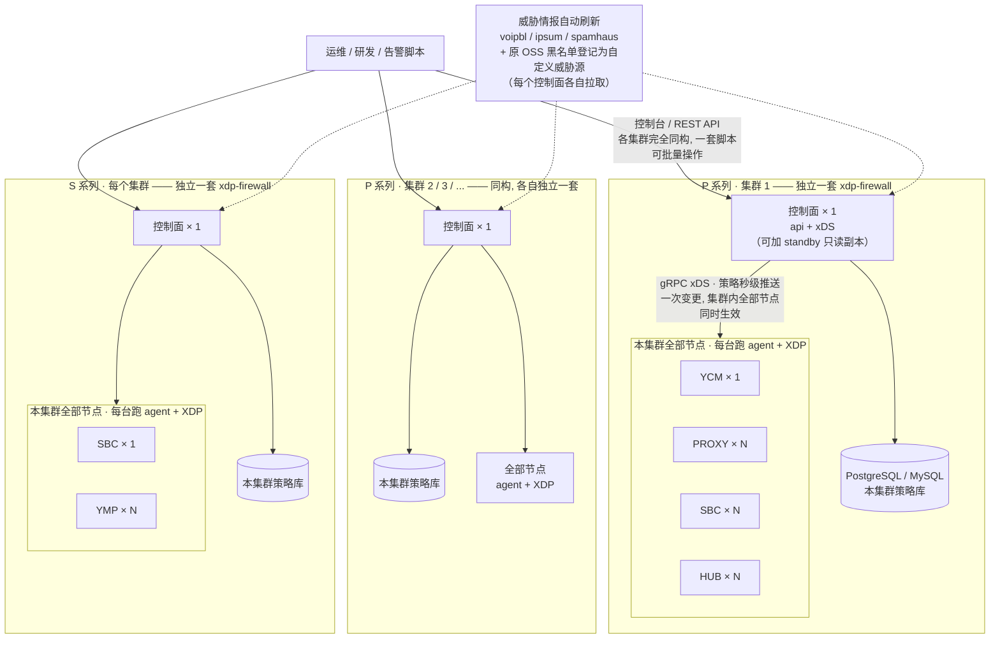
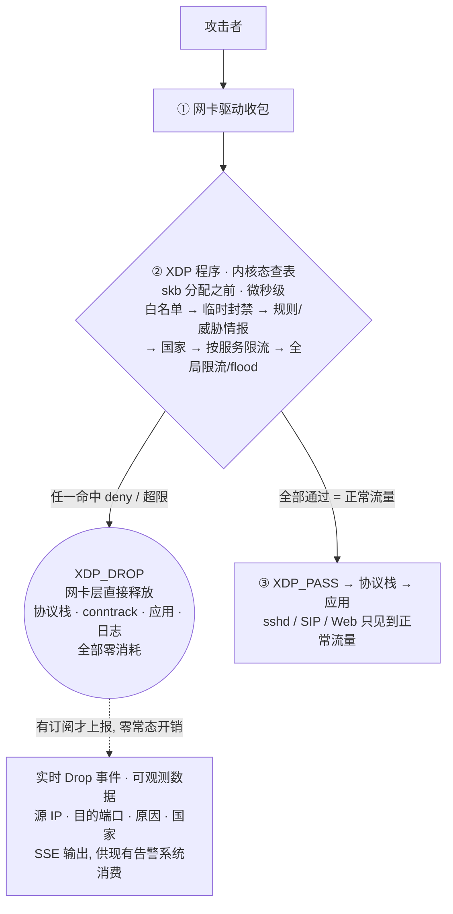
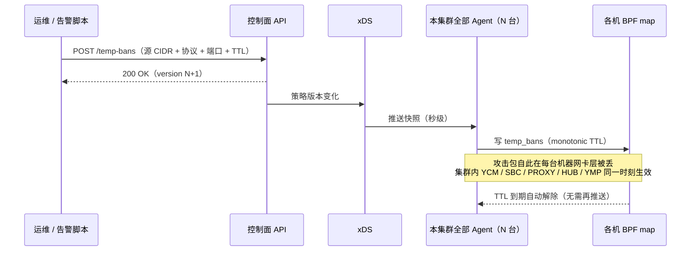

# xdp-firewall 方案介绍：传统防护痛点与内核级分布式防火墙

> 本文系统梳理传统云安全组与 fail2ban 的防护局限，并结合 P/S 系列现状，介绍基于 XDP/eBPF 的分布式内核级防火墙 xdp-firewall 的部署架构、防御数据流与解决的问题。

---

## 一、背景：当前面对的现实

以 P 系列 / S 系列服务器的现状为例，当前入口防护由三样东西拼成：**云安全组（静态 ACL）+ fail2ban（主机内事后拉黑）+ 人工发现与处置**。三样东西各自都有结构性缺陷，拼起来仍然留下三个大洞：

1. **拉黑不省资源**：P 系列自动拉黑全部是主机级别的，被拉黑的流量照样到达主机，照样消耗中断、协议栈、conntrack 和应用资源；S 系列则基本裸奔，靠人工发现再手动加安全组。
2. **告警看不到服务**：S 系列告警只看全局流量，识别不到具体服务；P 系列告警只覆盖 SIP，其他长期开放的服务（SSH、Web、数据库等）没有告警，也就没有防线。
3. **没有统一入口**：1000+ 个安全组按环境/区域割裂，研发环境封一次、测试环境再封一次、生产环境还要再封一次，同一次处置要重复 N 遍，容易漏也容易错。

**一句话总结现状：防护位置太深（流量到主机了才拦）、响应全靠人（发现靠人、封禁靠人）、管理是碎的（每个环境各管一摊）。**

---

## 二、现有防护体系的痛点

### 2.1 传统云安全组的痛点

云安全组工作在虚拟化层，位置确实靠前，但它的本质是**静态访问控制列表**，不是动态防御系统：

| # | 痛点 | 具体表现 |
| --- | --- | --- |
| 1 | 只能静态放行/拒绝 | 没有限流、没有自动封禁、没有威胁情报。端口开放期间，扫描、暴破、flood 全部直达主机 |
| 2 | 依赖人工响应 | "发现攻击 → 人工加规则"，响应时间以小时/天计；S 系列现状就是如此 |
| 3 | 规则数配额限制 | 各云厂商单个安全组规则数有硬性上限（一般几十到一两百条），按"封 IP"的模式运营根本不可持续 |
| 4 | 多环境/多区域割裂 | 安全组不跨环境、不跨区域、不跨云生效；1000+ 安全组没有全局黑名单视图，同一次处置要重复操作 |
| 5 | 变更慢、有速率限制 | 批量封禁走云 API，受速率限制和生效延迟约束，紧急处置时最要命 |
| 6 | 没有观测 | 不知道哪条规则挡了什么、谁在持续攻击；流日志延迟大、粒度粗、额外收费 |
| 7 | 粒度粗 | 不支持国家级地理封禁、威胁情报订阅、按服务的差异化限流 |

### 2.2 fail2ban 的痛点

fail2ban 是**主机内、用户态、基于应用日志的事后检测工具**，它的防护模型决定了天花板：

| # | 痛点 | 具体表现 |
| --- | --- | --- |
| 1 | 防护位置太深 | 数据包要先走完 网卡中断 → 内核协议栈 → conntrack → 应用程序 → 写日志，fail2ban 才"看见"它。即使拉黑后用 iptables 丢弃，攻击流量仍在消耗中断、软中断、skb 分配、协议栈资源——这就是"P 系列拉黑了流量仍然到主机、仍然占资源"的根因 |
| 2 | 只能保护"有日志且日志可解析"的服务 | 每个服务要单独写 jail/filter 正则；日志格式一变就漏报误报。SIP 之外的长期开放服务基本没有覆盖，UDP 服务、无日志组件更是盲区——对应 P 系列只有 SIP 告警的现状 |
| 3 | 单机作战 | 每台机器一套配置、一份封禁列表，互不共享；攻击者换一台机器继续打；100 台机器就是 100 份要维护的配置 |
| 4 | 规则线性匹配，规模一大性能崩 | iptables 逐条匹配，封禁 IP 上千后每个包都要遍历长规则链（O(n)）；封得越多主机越慢 |
| 5 | 检测本身消耗主机资源 | Python 常驻进程轮询日志 + 规则下发给 iptables，攻击越猛、日志越多，fail2ban 自己越吃 CPU——在最需要省资源的时刻加码 |
| 6 | 告警能力原始 | 只有邮件等简单动作，没有实时丢包流、没有服务维度、没有集中视图 |
| 7 | 环境适配差 | 容器/K8s 场景下日志路径、网络命名空间都是麻烦 |

### 2.3 痛点归拢：三条主线

| 主线 | 安全组的问题 | fail2ban 的问题 | 我们的业务表现 |
| --- | --- | --- | --- |
| **拦得不够早** | — | 防护在协议栈之后、日志层，拉黑后流量仍耗主机资源 | P 系列拉黑形同"挨了打才还手"，还手了还在挨打 |
| **防得不够自动** | 纯静态，靠人工加规则 | 依赖日志正则，覆盖面窄 | S 系列无自动防护；告警只有全局流量或只有 SIP |
| **管得不够统一** | 1000+ 安全组按环境/区域割裂，重复操作 | 每台机器独立配置 | 一次拉黑要跨研发/测试/生产重复执行，无统一入口 |

---

## 三、xdp-firewall 是什么

**一句话定位：基于 Linux XDP/eBPF 的分布式内核级防火墙——把"放行还是丢弃"的判断从应用层/日志层前移到网卡驱动层，配合集中控制面实现"一次配置、全集群生效、自动防御、服务级可见"。**

### 3.1 总体架构

- **控制面**：唯一写入方。REST API + 内嵌 Vue 控制台 + gRPC xDS 推送，策略持久化在数据库，维护单调递增的策略版本号。
- **Agent（数据面）**：每台服务器一个，不持有数据库凭据，只通过 xDS 订阅策略，把策略写进本机 BPF map；XDP 程序在**数据包进入内核协议栈之前**完成全部判定。
- **判定顺序**：白名单（最高优先级）→ 临时封禁 → 静态规则/威胁情报（LPM 前缀树）→ 国家规则 → 按服务自定义限流 → 全局每源 IP 限流/flood → 默认放行。

### 3.2 为什么"拦得早"就是"省资源"

- **native XDP 在驱动收包后、skb 分配前执行**，`XDP_DROP` 直接把包丢在网卡层：不分配 skb、不走 IP/TCP 协议栈、不进 conntrack、不唤醒应用、不产生日志。
- 即使云网卡不支持 native 模式（如 AWS ENA 巨帧 MTU），自动回退 **skb/generic 模式**，仍然在协议栈处理和 netfilter 之前丢包——依然远早于 iptables INPUT 链和 fail2ban。
- 判定全部是**内核态查表**（LPM trie，复杂度只与前缀长度相关，与规则数量无关），没有用户态参与，单包开销微秒级。规则容量默认 26 万条前缀级——对比安全组几十条的配额，差三个数量级。

### 3.3 能力总览

| 能力 | 说明 | 对应解决的现状问题 |
| --- | --- | --- |
| 静态规则 | CIDR allow/deny + 协议 + 端口，全局统一管理 | 替代分散的安全组封禁操作 |
| 威胁情报 | 内置 ipsum / spamhaus-drop / **voipbl**（VoIP 黑名单，贴合 SIP 业务）；控制面自动每日刷新，agent 不外联 | 已知恶意源自动挡在门外，无需人工维护黑名单 |
| 地理封禁 | 国家级 allow/deny，IP 列表自动更新 | 业务不需要的国家流量整体拒绝 |
| 动态防御（默认开启） | 每源 IP 令牌桶限速 + flood 超限自动临时封堵，全程内核态 | **自动防护**：不依赖日志、不依赖人工，S 系列不再裸奔 |
| 按服务自定义限流 | 按协议和/或目的端口配置（如 TCP/22、UDP/5060、443） | 长开放服务各有独立防线，不再只有 SIP 有防护 |
| 临时封禁 | 指定源 CIDR + 可选协议/端口 + TTL（BPF 单调时钟自动到期解除，无需再推送） | 一键对全部受管节点临时拉黑，到期自动恢复，不留垃圾规则 |
| 白名单 + K8s 自动发现 | 白名单优先级最高，保证运维/控制面永远可达；可自动发现 K8s Node/Pod/Service CIDR 加白 | 误封兜底，放心开自动防御 |
| 实时 Drop 观测 | 每个被丢的包可输出：节点、源 IP、协议、目的端口、命中原因（规则/威胁情报/国家/限流/临时封禁）、国家归属；SSE 流式订阅，无订阅时零开销 | **服务级可见**：第一次能回答"哪个服务正在被谁打" |
| 全 API 化配置 | 黑白名单、静态规则、临时封禁、动态防御、按服务限流、威胁源、国家规则全部可通过 REST API 增删改查；支持批量操作（单事务最多 500 条）、token 鉴权，每次变更返回新策略版本号 | 封禁不依赖人工上控制台：脚本、告警联动、SOAR 调 API 即对全部受管节点生效 |
| 节点管理 | 心跳、策略版本、同步状态、健康度集中可视 | 全集群防护状态一屏可见 |
| 部署形态 | 单二进制/单镜像；SQLite 单机 → PostgreSQL/MySQL 分布式；K8s DaemonSet 模板；控制面 standby 只读高可用 | 从 1 台到上千台同一套方案 |

---

## 四、改造前：S/P 系列现有组网与防御数据流

> 本章还原改造前的真实防御链路：现有组网，以及一个攻击包从到达网卡到被丢弃的完整旅程。

### 4.1 现有组网

**现有防线（S/P 全部主机各自为战，共两样）**：

1. **fail2ban（仅防 SSH 暴破）**：解析本机 auth.log，命中阈值后写本机 iptables。
2. **OSS 黑名单**：研发人工维护一份黑名单文件放在 OSS，每台机器各自用定时任务拉取、写进本机 iptables。

此外，现有告警能力有限：P 系列的告警只覆盖 SIP 流量，S 系列只有全局流量视角，均只告警、不联动拦截；其余场景靠人工发现后手动加安全组。

### 4.2 攻击包的真实旅程（改造前）

**这条链路上的三个断点**：

1. **判定点在链路末端**：无论是否已被拉黑，每个包都要先走完 ①②——中断、skb、conntrack 照常消耗。这就是"拉黑了流量仍然到主机、仍然占资源"的实物解释。
2. **封禁的产生又慢又散**：fail2ban 要等日志（分钟级）；OSS 黑名单靠研发人工维护 + 每台机器各自 cron 拉取（周期性滞后、可能漏拉）。且两者都只写**本机** iptables——P 系列几十台机器，同一个攻击 IP 每台都要再挨一次打、再各封一次。
3. **只覆盖 SSH**：SIP、Web 等长期开放的服务没有检测数据源，自然也没有服务级告警——S 系列只剩全局流量告警、P 系列只剩 SIP 告警的根因就在这。

---

## 五、改造后：xdp-firewall 部署架构与数据流防御

> 上一章的每个断点，在本章逐一对应到 XDP 的拦截点上。

### 5.1 部署架构（每个集群一套，叠加在现有组网上）

**部署要点**：

- **每个 P 系列集群、每个 S 系列集群各部署一套独立的 xdp-firewall**：控制面 1 台（api + xDS，可加 standby 只读副本高可用）+ 本集群的 PostgreSQL/MySQL 策略库；集群内 YCM、SBC、PROXY、HUB（或 SBC、YMP）全部节点各跑一个 agent，一套策略、一个版本号覆盖整个集群。
- **集群内统一入口**：一次封禁对集群内全部角色、全部节点同时生效，替代逐台机器、逐个安全组的重复操作；跨集群处置时，各集群控制台与 API 完全同构，同一套脚本批量调用各集群 API 即可。
- **每台业务主机跑一个 agent**：容器部署（host 网络 + privileged + `/sys/fs/bpf`），不动云安全组、不动 YCM/SBC/PROXY/HUB/YMP 应用；新增机器起一个 agent 即自动纳入本集群防护。
- **内核版本要求**：最低 Linux 4.11（BPF LPM trie 前缀树 map 自 4.11 引入，是本程序的下限），推荐 4.14+ 或 5.x LTS（5.4/5.15）。`uname -r` 自查；CentOS 7 默认 3.10 内核不支持，需升级内核或更换系统；Ubuntu 20.04/22.04、Debian 11+、RHEL/Rocky/Alma 8+ 均可直接使用。
- **OSS 黑名单平滑迁移**：各集群控制面把现有 OSS 文件登记为自定义威胁源（cidr/ips 格式），定时自动拉取刷新——研发继续维护同一个文件，但不再需要每台机器 cron、不再写 iptables；也可一次性批量导入为静态规则（API 单事务 500 条）。
- **fail2ban 可保留过渡、最终下线**：TCP/22 按服务限流替代其职责，无日志依赖、无滞后。

### 5.2 攻击包改造后的旅程（XDP 判定链）

### 5.3 四类攻击的防御对比（改造前后对照）

| 攻击场景 | 改造前：包走到哪、何时被拦 | 改造后：在哪被拦、消耗什么 |
| --- | --- | --- |
| SSH 暴破 | ①②④⑤ 走完 → fail2ban 分钟级解析日志 → 写**本机** iptables → 该 IP 后续的包到 ③ 才被丢（①② 继续消耗） | ② XDP 按服务限流（TCP/22）超阈值即丢；flood 触发自动临时封堵窗口，后续包全部网卡层释放。无日志、无滞后、无用户态进程 |
| 已知恶意 IP（OSS 黑名单 / 情报） | 研发人工维护 OSS → 每台机器 cron 拉取 → 写 iptables → 包到 ③ 被丢（①② 继续消耗）；哪台没拉到就继续挨打 | 黑名单 = 威胁源/规则 → 控制面自动刷新 → 全部节点 ② LPM 查表命中即丢；全集群秒级一致，无人参与 |
| SIP 攻击 / 扫描 | 无自动防护，包直达 SIP 服务；靠人发现再手动加安全组（小时~天级） | ② UDP/5060 按服务限流 + flood 自动封堵 + voipbl 情报三层自动拦；事件按目的端口聚合，可作为 SIP 级告警的数据源 |
| 新攻击源应急封禁 | 登录每台机器 / 每个环境的安全组逐个加规则 | 一次 API 调用（源 CIDR + 协议 + 端口 + TTL）→ 版本 +1 → xDS 秒级推本集群全部节点 → BPF map 生效；TTL 到期自动解除；跨集群由同一脚本批量调用 |

### 5.4 开启前后攻击包量对比

5.3 回答"在哪被拦"，这一节回答"拦下了多少"：同一台公网主机，未开启与开启 xdp-firewall 各观察 24 小时，各类探测/暴破流量的包量对比。

**统计口径（两侧对称，可复现）**：

| 侧 | 采集方法 |
| --- | --- |
| 未开启 | `lastb \| wc -l`（失败登录数）、auth.log 中 `Failed password` 行数、`tcpdump -i eth0` 按端口抓包计数、SIP/应用侧日志条数 |
| 开启后 | `xdp-firewall xdp status` 与控制台节点统计的八类分类计数器（放行 pass / 规则及威胁情报 rule_drop / 地理 geo_drop / 全局限流 rate_drop / flood flood_drop / 按服务限流 custom_rate_drop / 临时封禁 temp_ban_drop / 解析异常 parse_drop）；再取同样的 `lastb` 与应用日志条数（应归零） |

**测试配置**：动态防御默认参数；TCP/22、UDP/5060 配置按服务限流；启用内置威胁情报（ipsum / spamhaus-drop / voipbl）；地理封禁（仅放行业务所需国家）。

> 数据说明：下表为按公网主机典型攻击强度构造的**示例值**，用于确认统计口径与呈现形式；正式材料请用上述采集命令在目标环境实测后替换。

| 攻击/探测类型 | 未开启（24h，包到达主机） | 开启后（24h，XDP 层丢弃） | 开启后到达应用 |
| --- | --- | --- | --- |
| SSH 爆破（TCP/22） | 46,208 个包走完协议栈进入 sshd；`lastb` 失败登录 12,437 次、326 个源 IP | 按服务限流 19,862 ＋ flood 封堵 13,551 ＋ 临时封禁 12,795 | **0**：`lastb` 0 次，sshd 收到的认证请求为 0 |
| SIP 探测/注册暴破（UDP/5060） | 31,460 个包直达 SBC；应用侧产生 8,342 条非法 REGISTER/OPTIONS 日志 | 按服务限流 22,108 ＋ voipbl 威胁情报 9,352 | **0**：SBC 只处理合法终端流量 |
| 端口/漏洞扫描（22/23/445/3306/6379/8080…） | 97,335 个探测包进入协议栈；内核逐个回 RST/ICMP、conntrack 表项被撑高 | 地理封禁 71,246 ＋ flood 封堵 26,089 | **0** |
| 已知恶意源（ipsum/spamhaus 命中） | 9,714 个包全部到达主机 | 威胁情报规则（rule_drop）9,714 | **0** |
| **合计** | **184,717 包/日**进入协议栈与应用 | **184,717 包/日**全部在网卡驱动层释放 | **0** |

**怎么读这张表**：

1. **包量一包不少，只是位置变了**：同样是每天约 18.5 万个恶意包，改造前每一个都要消耗中断、skb 分配、协议栈、conntrack、应用 CPU 和日志磁盘；改造后它们在进入内核协议栈**之前**被释放，主机侧成本趋近于零（对应痛点 1）。
2. **应用视角"攻击消失了"**：开启后 `lastb`、auth.log、SIP 日志中的攻击记录全部归零——不是因为没被打，而是攻击包到不了应用。日志量、CPU 软中断、conntrack 占用同步下降。
3. **拦了多少、谁打的、为什么拦，全部有账可查**：每一行丢弃都有分类计数器与实时 Drop 事件（源 IP / 目的端口 / 命中原因 / 国家）背书，而不是"安全组说它挡了就挡了"。
4. **各行按"命中的第一道防线"归类，不重复计数**；未命中任何规则的杂散流量按默认策略放行（与正常流量同路径），其中若出现新的攻击源，会被每源 IP 限流与 flood 检测兜住并进入临时封禁。

### 5.5 应急封禁联动时序

**一句话总结**：同一个攻击包，改造前要走完五层才可能被丢、封禁还要等几分钟且只封一台；改造后它连协议栈都进不去，而封它的动作是一次 API 调用、一秒内全集群生效（跨集群由同一脚本批量完成）。

---

## 六、三大痛点逐一击破

### 痛点 1：主机级拉黑仍耗资源，S 系列无自动防护

**现状**：P 系列靠 fail2ban 类主机级拉黑，包已经进协议栈、进应用、写完日志才被识别和丢弃；S 系列没有自动防护，人工发现后手动加安全组。

**xdp-firewall 的解法**：
- 所有节点统一部署 XDP agent，**攻击包在网卡驱动层被直接丢弃**——不消耗 skb、协议栈、conntrack、应用和日志资源，主机资源占用趋近于零。
- **动态防御默认开启且全程内核态**：每源 IP 令牌桶限速、flood 超限自动进入临时封堵窗口。不需要日志、不需要正则、不需要人工，装上即有防线。
- 威胁情报 + 地理封禁把已知恶意源整体挡在门外：内置 voipbl 直接覆盖 SIP 攻击源，ipsum/spamhaus 覆盖通用恶意 IP。

**一句话总结**：以前是"挨了打才还手，还手了还在挨打"；现在是攻击包到网卡就被丢弃，主机根本感知不到攻击。而且这套防线是自动的，不依赖任何人发现攻击。

### 痛点 2：告警识别不到具体服务

**现状**：S 系列告警只有全局流量视角，P 系列只有 SIP 告警——根源是**现有工具拿不到"哪个服务在被谁打"这个数据**：安全组无观测，fail2ban 只有日志视角。

**xdp-firewall 的解法**：
- 实时 Drop 事件自带 **目的端口 + 协议 + 源 IP + 命中原因 + 国家归属 + 节点**——按目的端口聚合就是服务维度（5060=SIP、22=SSH、443=Web…），按命中原因就知道攻击类型（暴破触发限流、恶意源命中情报、扫描触发 flood）。
- 事件通过 SSE/HTTP 流输出（`GET /drop-events/stream`），**直接对接现有监控系统/告警通道**（Zabbix、Prometheus、自研告警均可），不需要推翻现有告警体系。
- 按服务配置差异化限流后，每个长期开放的服务都有独立阈值、独立丢包数据——为"某环境的某服务正在被某源 IP 攻击"这个精度的告警提供了数据基础。

**定位说明**：xdp-firewall 本身不做告警通道，它提供的是以前根本拿不到的**服务级丢包数据源**。数据有了，接哪套告警都只是配置问题；而且检测与处置能闭环——告警确认后反向调用封禁 API，一次调用即整个集群生效。

**一句话总结**：不是告警系统不行，是以前根本没有这个粒度的数据。安全组不告诉你它挡了什么，fail2ban 只认得它配过正则的服务。现在每个被丢弃的包都自带"谁、打哪个端口、因为什么被拦"，接上现有告警就是服务级告警。

### 痛点 3：1000+ 安全组，拉黑无统一入口

**现状**：安全组按环境/区域割裂，一次拉黑要在研发、测试、生产各操作一遍，每个 region 再来一遍；没有全局视图，靠人记靠人对，容易漏。

**xdp-firewall 的解法**：
- **每个集群一套统一策略**：一个控制台、一套策略、一个版本号，通过 xDS 秒级推送到集群内全部节点（P 系列：YCM/SBC/PROXY/HUB；S 系列：SBC/YMP）——**封一次 = 全集群生效**，替代逐台机器、逐个安全组的重复操作。
- **跨集群同构、可批量**：各集群控制台与 REST API 完全同构，同一套脚本循环调用各集群 API，即可完成研发/测试/生产多集群的同步处置。
- **统一入口既是控制台，更是 API**：黑白名单、临时封禁、动态防御等所有封禁规则都可通过 REST API 配置（支持批量、token 鉴权）——人工点控制台、脚本自动化、告警系统联动封禁，走的是同一套策略、同一条版本线。
- 临时封禁支持"源 CIDR + 协议 + 端口 + 时长"一键下发，到期由 BPF 时钟自动解除，不留任何垃圾规则。
- 白名单最高优先级且支持 K8s CIDR 自动发现加白，所以全局策略可以放心下发而不怕误伤运维通道。
- 节点心跳与策略版本集中可视，哪台机器没同步一目了然——1000+ 安全组的"靠人对账"变成"一屏看全"。

**一句话总结**：以前的安全组是每个环境一扇门，锁要一把一把去锁；现在每个集群一个总闸——拉一次闸，全集群断电，到期自动恢复。

---

## 七、对比总表

| 维度 | 云安全组 | fail2ban | xdp-firewall |
| --- | --- | --- | --- |
| 防护位置 | 虚拟化层（靠前但纯静态） | 主机内，协议栈+日志之后 | **网卡驱动层（XDP），协议栈之前** |
| 自动封禁 | ❌ | ⚠️ 依赖日志正则，覆盖窄 | ✅ 内核态限速 + flood 自动封堵，默认开启 |
| 按服务限流 | ❌ | ⚠️ 逐服务写规则 | ✅ 协议+端口维度自定义阈值 |
| 威胁情报 | ❌ | ❌ | ✅ 内置 ipsum/spamhaus/voipbl，自动更新 |
| 地理封禁 | ❌ | ❌ | ✅ 国家级 allow/deny |
| 集中管理 | ⚠️ 按环境/区域割裂 | ❌ 每台机器独立 | ✅ 每集群一套策略，集群内秒级生效 |
| API 配置与自动联动 | ⚠️ 各账号/区域独立 API，受速率配额限制 | ❌ 只能逐台改配置文件 | ✅ 全策略 REST API + 批量 + 版本化，跨集群 API 同构可批量 |
| 规则容量 | 配额几十条 | 上千条后性能下降 | 默认 26 万前缀，查表 O(前缀长度) |
| 被拦流量的主机开销 | 无（在宿主机拦） | 高（进协议栈+conntrack+应用+日志） | **趋近零（驱动层丢弃）** |
| 观测/告警数据 | 基本没有 | 日志视角，单机 | 源IP/服务/原因/国家级实时事件流 |
| 容器/K8s | — | 适配差 | DaemonSet 模板，K8s CIDR 自动加白 |

> **客观定位**：云安全组不是要被替代，而是退回它擅长的角色——静态 ACL 兜底（管理端口、放行业务网段）。xdp-firewall 承担安全组做不了的部分：动态、自动化、细粒度、可观测。两层配合，安全组规则数还能大幅精简。

---

## 八、常见问题（FAQ）

**Q1：XDP 会影响业务性能/稳定性吗？**
判定是内核态查表，微秒级；实时 Drop 观测默认关闭，只有有人订阅时才开启 perf 事件读取，平时零观测开销。控制面故障不影响转发——策略已写入各节点 BPF map，agent 按最后下发的策略继续执行。

**Q2：误封怎么办？**
三重兜底：白名单优先级最高（运维/控制面地址永不被拦）；K8s 环境自动发现集群 CIDR 加白；临时封禁带 TTL 自动解除。动态防御的限速阈值按服务可调。

**Q3：对内核版本有什么要求？云主机/网卡支持吗？**
最低 Linux 4.11：XDP 的 skb/generic 模式自 4.8 起可用，本系统 BPF 程序使用的 LPM trie 前缀树 map 自 4.11 引入，因此整体下限为 4.11。推荐 4.14+ 或 5.x LTS（5.4/5.15）：主流驱动的 native XDP 支持更完整，5.11 起 BPF 内存走 memcg 计费，不再受 memlock 上限约束。`uname -r` 可自查；CentOS 7 默认 3.10 内核不支持，需升级内核或更换系统；Ubuntu 20.04/22.04、Debian 11+、RHEL/Rocky/Alma 8+ 均可直接使用。
native 驱动级 XDP 优先，主流云网卡驱动的 native XDP 在 4.9–4.14 期间陆续合入；驱动不支持时自动回退 skb 模式（如 AWS ENA 巨帧 MTU 场景已有专门适配），回退后仍在协议栈前丢包。运行需要 privileged 或 `CAP_BPF`/`CAP_SYS_ADMIN` 与 `/sys/fs/bpf` 挂载，K8s DaemonSet 模板已包含。

**Q4：和现有告警/监控怎么整合？**
xdp-firewall 自身不做告警判定与通知，提供的是数据源：实时 Drop 事件走 SSE 流 + 每节点分类丢包计数器（规则/情报/国家/限流/临时封禁）。Prometheus/Zabbix/自研告警等现有系统消费这些数据后完成告警，不需要推翻现有体系。

**Q5：部署复杂度？**
一个二进制/镜像包含控制面、agent、eBPF 程序和 Web 控制台。单机 SQLite 起步，多机切 PostgreSQL/MySQL，agent 永远不持有数据库凭据（只连 xDS）。控制面支持 standby 只读副本高可用。

**Q6：规则谁审批、谁可操作？**
HTTP API 全部 token 鉴权，非回环绑定强制 token；单一策略 + 版本号天然是审计线（谁改的、改了什么、推到哪版）。可对接现有变更流程。自动化联动（如告警触发自动封禁）只需给脚本发放 API token，机器动作与人工操作落同一条版本线，可审计、可追溯。

**Q7：控制面与 agent 之间的链路安全吗？**
默认为明文 gRPC + agent token 认证（token 在非回环绑定时强制启用），适合私网/VPC 内部署。有更高安全要求时可开启 TLS/双向认证（mTLS），且无需预先准备证书：控制面 `--xds-tls-auto` 会在数据目录自动生成整套私有 CA、服务端证书与 agent 客户端证书（重启复用），也可用 `--xds-tls-cert/--xds-tls-key/--xds-tls-client-ca` 指定自有证书；agent 侧把控制地址改为 `https://` 并指定 CA（或 `--xds-tls-insecure` 跳过服务端校验）即自动启用。HTTP API 控制台可通过 `--api-tls` 复用同一张服务端证书提供 https。以上均默认关闭，不影响现有部署。

---

## 九、总结

**三个关键词**：

1. **内核级** —— XDP 驱动层丢弃，攻击流量不进协议栈，主机资源占用趋近于零。
2. **自动化** —— 内核态限速/flood 封堵 + 威胁情报 + 地理封禁 + 封禁规则全 API 化，防线不依赖人。
3. **统一** —— 每个集群一套策略、一个入口，集群内秒级生效、跨集群 API 同构可批量，告别 1000+ 安全组的重复操作。

**一句话价值**：把入口安全从"**人工、事后、单机、粗粒度**"升级为"**自动、事前、全局、服务级**"。